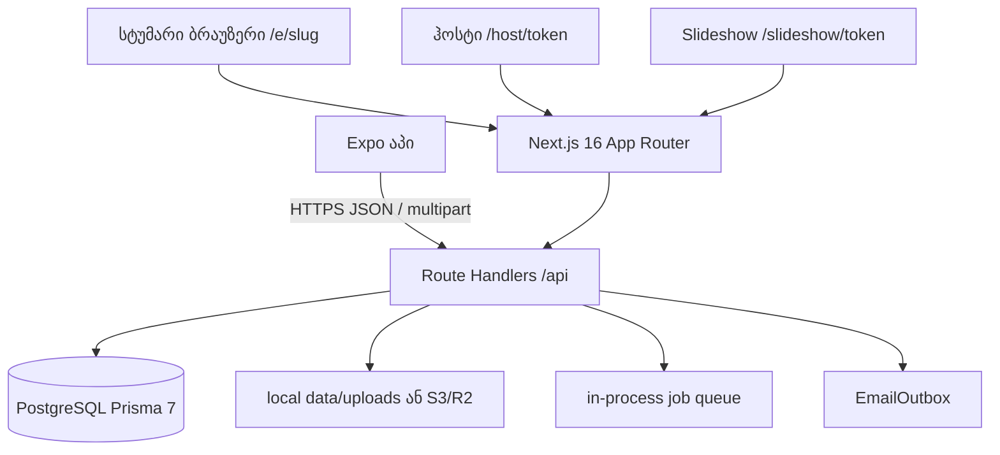

# არქიტექტურა

წყარო: `web/src/lib/prisma.ts`, `web/prisma/schema.prisma`, `web/docs/ARCHITECTURE.md`, `web/package.json`, `app/package.json`, `.github/workflows/ci.yml`, `README.md`. რანთაიმი ბაზა არის **PostgreSQL**. `web/README.md`, `web/docs/ARCHITECTURE.md` და `web/docs/CONTRIBUTING.md` ჯერ კიდევ წერენ SQLite-ს — ეს დრიფტია (`docs/TASKS.md`).

## ნაკადი



1. სტუმარი ან ჰოსტი ხსნის capability URL-ს (slug ან token). აპი იძახებს იმავე API-ს (`EXPO_PUBLIC_API_URL`, default `https://qr.socialsave.cc`).
2. გვერდი (server component) ან კლიენტი იძახებს Route Handler-ს. Zod ამოწმებს body-ს.
3. Handler წერს PostgreSQL-ში (`Event` და შვილები `eventId`-ით) და ფაილს storage-ში.
4. Thumbnail/derivatives შეიძლება სინქრონულად ან `src/lib/jobs/queue.ts` FIFO worker-ით (ერთი პროცესი).
5. წერილი ჯდება `EmailOutbox`-ში; გაგზავნა `POST /api/cron/email` (`CRON_SECRET`). `package.json`-ში `email:worker` script არ არის.

ცალკე DB თითო ტენანტზე არ არის. იზოლაცია: `eventId`, `getEventByHostToken`, `assertMediaBelongsToEvent`, `ownerUserId`, `EventCoHost`. ტესტი: `web/tests/tenant-isolation.test.ts`.

### სტუმრის ატვირთვა

`GET /api/guest/[slug]` → ლიმიტები, branding. `POST .../upload` → rate limit, `validateAndProcessUpload` (sharp / HEIC), `storage.putObject`, `Media` + quota. Offline: `web/src/lib/offline-upload-queue.ts` (IndexedDB) და აპის `upload-queue.ts`.

ატვირთვა დაშვებულია თუ event აქტიურია (`isPaid`, `expiresAt`, პლანის ლიმიტი). `revealAt`-მდე disposable upload აბრუნებს 403.

### ჰოსტი

`GET /api/host/{token}` აბრუნებს JSON-ს და `csrfToken`. `middleware` აყენებს `memento_host_csrf`. მუტაცია ითხოვს `x-csrf-token`. მედიის URL ხელმოწერილია (`MEDIA_SIGNING_SECRET`).

### Slideshow

`GET /api/slideshow/{token}/stream` — SSE, poll დაახლოებით 2.5 წმ, მხოლოდ `approved`. ჰოსტის preview: `/api/host/{token}/slideshow/stream`, poll დაახლოებით 3 წმ.

### აპი

Expo Router (`app/app/`). State: Zustand (`auth-store`, `guest-store`) და TanStack Query. სესია: Bearer `MobileAccessToken`, არა cookie. გადახდა იხსნება ბრაუზერში, შემდეგ poll.

## ტექნოლოგიები

| ფენა | რეალური სტეკი |
|------|----------------|
| Web UI | Next.js 16.3.8 App Router, React 19.2, Tailwind CSS 4, Framer Motion, `lucide-react` |
| Web API | Route Handlers, Zod 4, `iron-session` / cookie session, `jose`, `bcryptjs` |
| მობილური | Expo SDK 57, expo-router, React Native 0.86, React 19.2, Reanimated, Zustand, TanStack Query, i18next |
| DB | PostgreSQL. Prisma 7, `@prisma/adapter-pg`, `pg`. Client: `web/src/generated/prisma`. CI: Postgres 16. Prod runbook: PG18 (`docs/RUNBOOK.md`) |
| Storage | `STORAGE_BACKEND=local` → `./data/uploads`, ან `s3` (Cloudflare R2, path-style). `sharp`, `heic-convert` |
| PWA | `@serwist/next`, `web/src/sw.ts` → `public/sw.js` |
| ფოსტა | `nodemailer` / `resend` / log (`EMAIL_PROVIDER`) |
| გადახდა | `stripe`, `web/src/lib/billing/` (TBC, BOG, Flitt, mock) |
| Rate limit | `rate-limiter-flexible` `RateLimiterMemory` (Redis არ არის) |
| ტესტი | web: Vitest + Playwright. app: Jest (`**/__tests__/**/*.test.ts`) |
| CI | GitHub Actions, Node 22, `ubuntu-24.04`, `npm ci --legacy-peer-deps` |

`better-sqlite3` და `@prisma/adapter-better-sqlite3` კვლავ არიან `web/package.json`-სა და `serverExternalPackages`-ში. `web/scripts/seed-demo.mjs` იყენებს SQLite adapter-ს, მაგრამ `npm run seed:demo` იძახებს `scripts/seed-demo.ts`-ს, რომელიც `src/lib/prisma.ts`-ს (PostgreSQL).

Auth მოდელი (`web/docs/en/HANDOVER.md`, კოდით განახლებული): სტუმარი/slideshow/ჰოსტი — token URL. Dashboard — cookie `memento_user` → `Session`. ადმინი — `memento_admin`. აპი — Bearer.

## საქაღალდეები

```
/
├── web/                 Next.js. ინსტალი და build მხოლოდ აქედან
│   ├── src/app/         App Router: (marketing), e/, host/, gallery/, slideshow/, api/
│   ├── src/components/  UI (guest, host, pwa, marketing, payment, admin)
│   ├── src/lib/         auth, billing, storage, i18n, jobs, email
│   ├── prisma/          schema + migrations
│   ├── tests/           Vitest და tests/e2e Playwright
│   ├── tokens.css       ფერები და ტიპოგრაფიკა
│   └── docs/            დეტალური ქართული დოკუმენტაცია (API, SECURITY, …)
├── app/
│   ├── app/             Expo Router ეკრანები
│   ├── src/             api, components, theme, stores, i18n
│   └── docs/            MOBILE-API, audit, API-NEEDS (ისტორიული)
├── shared/              brand-palette.json, api-contract.ts, MOBILE-API.md
│                        runtime import web/app-იდან გადატანილი არ არის
├── docs/                ეს ფაილები, audit/, RUNBOOK, MOBILE-API, SOCIAL-LOGIN
├── scripts/             web-deploy-bundle.sh
└── .github/workflows/ci.yml
```

Production დეპლოი იღებს მხოლოდ `web/` ხეს. გენერაცია: `./scripts/web-deploy-bundle.sh`.

## Storage და რიგი

| `STORAGE_BACKEND` | ქცევა |
|-------------------|--------|
| `local` (default) | `LOCAL_STORAGE_PATH`, ჩვეულებრივ `./data/uploads` |
| `s3` | `S3_*`, path-style endpoint |

გასაღები: `events/{eventId}/{mediaId}.ext` (`web/src/lib/storage.ts`).

`enqueue` / `enqueueThumbnail` — in-process მასივი, ერთი worker. შეცდომა ლოგდება, request-ს არ აბრუნებს.

PWA cache (`web/docs/ARCHITECTURE.md`): `/api/*` NetworkOnly; thumb NetworkFirst ~5 წთ; navigation fallback `/offline`. Background Sync tag `memento-upload-sync`.
