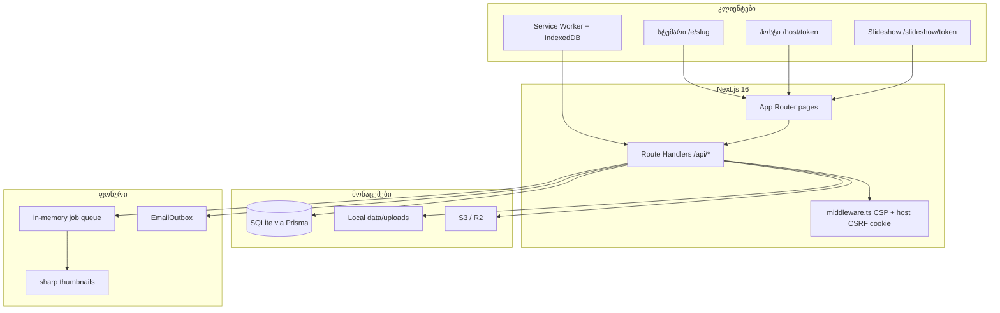
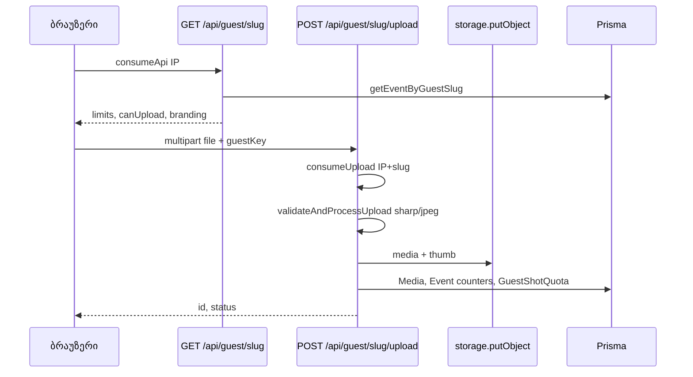

# არქიტექტურა

Memento არის **მონოლითური Next.js აპი**: UI + API Route Handlers + Prisma + ფაილური/S3 storage ერთ პროცესში. ტენანტის ძირითადი ერთეულია **`Event`** — მედია, guestbook, push და quotas მასზეა მიბმული.

---

## სისტემის მიმოხილვა

---

## რეპოზიტორიის სტრუქტურა

| საქაღალდე | დანიშნულება |
|-----------|-------------|
| `src/app/` | App Router: marketing `(marketing)/`, guest `e/`, host `host/`, API `api/` |
| `src/components/` | UI: `guest-upload`, `host-dashboard`, `pwa/*`, `admin-*` |
| `src/lib/` | ბიზნეს ლოგიკა: `auth`, `storage`, `billing`, `rate-limit`, `i18n` |
| `src/generated/prisma/` | Prisma Client (generate) |
| `src/sw.ts` | Serwist service worker წყარო → build → `public/sw.js` |
| `prisma/schema.prisma` | მონაცემთა მოდელი |
| `scripts/` | seed, screenshots, PWA icons, partner session |
| `tests/` | Vitest (`*.test.ts`), Playwright (`e2e/`) |
| `public/` | სტატიკა, PWA icons, `seed-samples/`, `demo-manifest.json` |
| `docs/` | დოკუმენტაცია |

დეტალური ER და ცხრილები: [database.md](database.md).

---

## მოთხოვნის ნაკადები

### 1. სტუმრის ატვირთვა

- **აქტიურობა:** `Event.isPaid`, `expiresAt`, plan limits (`src/lib/plans.ts`, `eventAllowsUpload`).
- **Disposable:** `disposableEnabled`, `shotsPerGuest`, `revealAt` — ხილვამდე ატვირთვა 403.
- **Offline:** `src/lib/offline-upload-queue.ts` — IndexedDB → `flushUploadQueue` → იგივე upload API.

### 2. ჰოსტის დაფა

- **Bootstrap:** `GET /api/host/{hostToken}` — JSON + `csrfToken` (HMAC).
- **CSRF:** `middleware` აყენებს `memento_host_csrf` cookie-ს; mutating requests — header `x-csrf-token` (`verifyHostCsrf`).
- **მედია:** signed URLs `/api/media/{id}?token=` (`MEDIA_SIGNING_SECRET`, 1h TTL).

### 3. Slideshow SSE

| Endpoint | ქცევა |
|----------|--------|
| `GET /api/slideshow/{token}/stream` | SSE poll ~2.5s, მხოლოდ `approved` media |
| `GET /api/host/{token}/slideshow/stream` | SSE poll ~3s, ბოლო media (host preview) |

ფორმატი: `text/event-stream`, `data: {JSON}\n\n`.

### 4. PWA / Service Worker

- **Build:** `next.config.ts` + `@serwist/next` → `public/sw.js`.
- **Dev SW:** `PWA_DEV=1` და `NEXT_PUBLIC_PWA_DEV=1`.
- **Caching:** `/api/*` → NetworkOnly; thumb URLs → NetworkFirst 5min; navigation → `/offline` fallback.
- **Background Sync:** tag `memento-upload-sync` → `postMessage FLUSH_UPLOAD_QUEUE` client-ებზე.

### 5. Web Push

- VAPID: `NEXT_PUBLIC_VAPID_PUBLIC_KEY`, `VAPID_PRIVATE_KEY`, `VAPID_SUBJECT`.
- Subscribe: `POST /api/host/{token}/push/subscribe`.
- Upload notifications: batched 2min / 12 items (`notifyBatchedUploads` in `push-server.ts`).

---

## მულტი-ტენანტობა

- **ლოგიკური იზოლაცია:** ყველა query `eventId`-ით ან token/slug-ით (`getEventByHostToken`, `assertMediaBelongsToEvent`).
- **User ownership:** `ownerUserId`, `EventCoHost`, `requireEventOwner` (`user-session.ts`).
- **Partner:** `Event.partnerOrgId` → `PartnerOrg` branding; partner API მხოლოდ partner-ის events-ს აბრუნებს.
- **ტესტი:** `tests/tenant-isolation.test.ts`.

ცალკე DB/schema per tenant **არ არის**.

---

## Storage

| `STORAGE_BACKEND` | ქცევა |
|-------------------|--------|
| `local` (default) | `LOCAL_STORAGE_PATH` → `./data/uploads` |
| `s3` | `S3_*` env, path-style endpoint (R2) |

ფუნქციები: `putObject`, `getObject`, `deleteObject`, `getSignedMediaUrl` (`src/lib/storage.ts`). Keys: `events/{eventId}/{mediaId}.ext`.

---

## Job queue

`src/lib/jobs/queue.ts` — **in-process FIFO**, ერთი worker. გამოიყენება thumbnail-ის async enqueue-ისთვის; upload path-ზე thumb ხშირად synchronous-იცაა.

---

## Email outbox

`queueEmail()` → `EmailOutbox` row (`template`, JSON `payload`). **გაგზავნის worker/SMTP კოდი აპში არ არის** — dev-ში `console.info`. Production-ში საჭიროა გარე worker ან პროვაიდერი.

---

## დაკავშირებული დოკუმენტები

- [FEATURES.md](FEATURES.md) — პროდუქტული ფუნქციები
- [API.md](API.md) — endpoints
- [SECURITY.md](SECURITY.md) — auth და hardening
