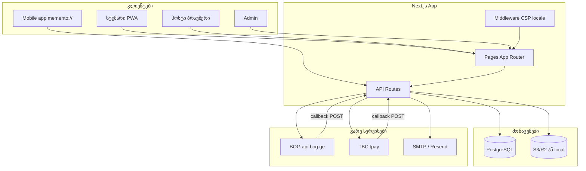

# Memento — სისტემის აღწერა (Phase 1 აუდიტი)

**აუდიტის ბაზა:** git tag `audit-baseline` (main-ის მდგომარეობა Phase 1-ის დასაწყისში)  
**გარემო:** ლოკალური VM — PostgreSQL, `PAYMENT_MOCK=1`, ელფოსტა log/sink; **production (`qr.socialsave.cc`) არ შეხებულა.**

---

## რა არის Memento?

Memento არის ქორწილის/ღონისძიების ფოტო-პლატფორმა: სტუმრები ატვირთავენ ფოტო/ვიდეოს სმარტფონით, წყვილი (ჰოსტი) ხედავს ყველაფერს პანელში, შეუძლია ZIP, სლაიდშოუ, guestbook, გადახდა გეგმისთვის.

**ვისთვის:** სტუმარი (guest), წყვილი/ორგანიზატორი (host), თანა-ჰოსტი (co-host), პარტნიორი B2B (partner), ადმინი (admin).

---

## როლები და უფლებები (მოკლედ)

| როლი | როგორ «შედის» | რა შეუძლია |
|------|----------------|------------|
| **სტუმარი** | ღია ბმული `/e/{guestSlug}` (QR) | ატვირთვა, guestbook, (disposable camera ლიმიტები) |
| **ჰოსტი** | საიდუმლო `/host/{hostToken}` (~32 სიმბოლო) | ყველა მედია, წაშლა, ZIP, პараметრები, გადახდა, push |
| **Co-host** | magic link / invite + ანგარიში | host API mutation Bearer/mobile/CSRF-ით |
| **Partner** | `/login` + PartnerMember | `/partner`, checkout credits |
| **Admin** | `/admin` + პაროლი | ივენთების სია, `isPaid` toggle, DB snapshot, BOG refund |

**მნიშვნელოვანი:** hostToken და slideshowToken — capability URL-ები; ვინც იცის, იმ event-ზე წვდომა აქვს (password reset არ არის).

---

## გვერდები (UI)

Marketing: `/`, `/pricing`, `/faq`, `/for-partners` (+ `/en`, `/ru`).  
Auth: `/login`, `/onboarding`, `/create`, `/dashboard`.  
Guest: `/e/[slug]`, `/gallery/[slug]` (პაროლი optional).  
Host: `/host/[token]`, `/host/[token]/pay`, `/host/[token]/slideshow`.  
Slideshow: `/slideshow/[token]`.  
Partner: `/partner`. Admin: `/admin`.  
Dev/demo: `/pay/mock`, `/offline`, `/pwa-preview` (prod-ში redirect).

---

## API და ინტეგრაციები

~58 HTTP handler `src/app/api/` — სრული სია **დანართი A**.

**გადახდები:** BOG, TBC, Stripe, Flitt, manual; mock — `PAYMENT_MOCK=1`.  
**Callback:** `POST /api/payments/bog/callback` (RSA ხელმოწერა + receipt).  
**ელფოსტა:** `EmailOutbox` + `POST /api/cron/email` ან `scripts/email-worker.ts`.  
**Storage:** local ან S3/R2; signed URL `/api/media/[id]`.  
**Push:** Web Push (VAPID) + Expo token storage (mobile).

---

## მონაცემთა ბაზა

PostgreSQL, Prisma — 25 მოდელი (User, Event, Media, Payment, Partner*, GuestMessage, …).  
დიაგრამა **დანართი B**.

---

## რა არის დასრულებული / ნაწილობრივ / ორმაგი

| სტატუსი | მაგალითები |
|---------|------------|
| **დასრულებული core** | Guest upload, host panel, billing adapters, PWA, i18n ka/en/ru |
| **ნაწილობრივ** | Partner portal, Expo push «storage only», disposable camera edge cases |
| **ორმაგი/legacy** | `/api/webhooks/bog` = იგივე BOG handler რაც `/api/payments/bog/callback` |
| **ფარული/dev** | `/api/e2e/*` (მხოლოდ `E2E_SECRET`), `/api/payments/mock/complete` |
| **შესაძლო dead code** | `POST /api/payment/stub` — manual instructions JSON, auth არა |

---

## არქიტექტურა (Mermaid)

---

## დანართი A — API სრული სია

იხ. ტექნიკური ექსპორტი: `docs/API.md` + აუდიტის mapping subagent-ის ანგარიში (2026-10-03). ჯ�roups: auth, guest, host, slideshow, gallery, media, billing, webhooks, partner, admin, cron, e2e.

---

## დანართი B — Prisma მოდელები

`User`, `Session`, `MagicLinkToken`, `MobileAccessToken`, `OAuthAccount`, `PartnerOrg`, `PartnerMember`, `PartnerReferral`, `PartnerSubscription`, `Event`, `Media`, `GuestMessage`, `GuestShotQuota`, `MediaReaction`, `EventCoHost`, `CoHostInvite`, `PushSubscription`, `MobilePushRegistration`, `Payment`, `PaymentWebhookEvent`, `AdminSession`, `AuditLog`, `EmailOutbox`, `UsageSnapshot`.

**Cascade:** User/Event/Media უმეტესად `onDelete: Cascade`. Payment → Event/User optional, cascade არა everywhere.

---

## დანართი C — Cron / background

| რა | სად |
|----|-----|
| Email outbox | `POST /api/cron/email` Bearer `CRON_SECRET` |
| Expiry reminders | `?mode=expiry` |
| Thumbnail | inline Sharp upload-ზე |
| Offline queue | browser IndexedDB → guest upload |

---

*Phase 1 — audit/phase1 branch. Production merge მფლობელის approval-ით.*
