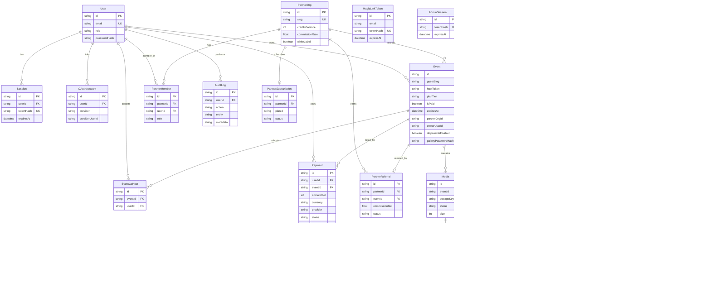

# Memento — მონაცემთა ბაზის არქიტექტურა

ეს დოკუმენტი აღწერს Prisma სქემაში არსებულ ყველა მოდელს, მათ კავშირებს და ბიზნეს ლოგიკას: მულტი-ტენანტობა, პაკეტები, პარტნიორები, მედია, guestbook, push და ბილინგი.

---

## ER დიაგრამა (Mermaid)



იგივე ფაილი: `docs/database-er.mmd` (PNG-ის გენერაციისთვის).

---

## მოდელები (ველები და დანიშნულება)

### User

| ველი | ტიპი | დანიშნულება |
|------|------|-------------|
| id | String (PK) | უნიკალური მომხმარებელი |
| email | String (UK) | შესვლა / magic link |
| name | String? | სახელი |
| emailVerified | DateTime? | ვერიფიკაციის დრო |
| image | String? | ავატარი |
| role | String | `user` \| `admin` \| `partner` |
| passwordHash | String? | პაროლი (თუ არის) |
| createdAt / updatedAt | DateTime | აუდიტი |

### Session

| ველი | ტიპი | დანიშნულება |
|------|------|-------------|
| id | PK | სესია |
| userId | FK → User | მფლობელი |
| tokenHash | UK | cookie `memento_user` ჰეში |
| expiresAt | DateTime | ვადა |

### MagicLinkToken

| ველი | ტიპი | დანიშნულება |
|------|------|-------------|
| email | String | მიმღები |
| tokenHash | UK | ერთჯერადი ლინკი |
| expiresAt | DateTime | ვადა |

### OAuthAccount

| ველი | ტიპი | დანიშნულება |
|------|------|-------------|
| userId | FK → User | ანგარიში |
| provider | String | მაგ. `google` |
| providerUserId | String | გარე ID |

### PartnerOrg

| ველი | ტიპი | დანიშნულება |
|------|------|-------------|
| name | String | სტუდია / ობიექტის სახელი |
| slug | UK | URL/API იდენტიფიკატორი |
| logoUrl | String? | white-label ლოგო |
| primaryColor / secondaryColor | String | ბრენდინგი |
| commissionRate | Float | კომისიის % |
| creditsBalance | Int | ღონისძიების კრედიტები |
| whiteLabel | Boolean | პარტნიორის ბრენდი ღონისძიებაზე |

### PartnerMember

| ველი | ტიპი | დანიშნულება |
|------|------|-------------|
| partnerId | FK | ორგანიზაცია |
| userId | FK | წევრი |
| role | String | `owner` \| `staff` |

### PartnerReferral

| ველი | ტიპი | დანიშნულება |
|------|------|-------------|
| partnerId | FK | პარტნიორი |
| eventId | FK (UK) | რეფერირებული ღონისძიება |
| commissionGel | Float | კომისია ლარში |
| status | String | `pending` \| `paid` |

### PartnerSubscription

| ველი | ტიპი | დანიშნულება |
|------|------|-------------|
| partnerId | FK (UK) | ერთი აქტიური გეგმა |
| planId | String | B2B გეგმა |
| status | String | `active` და სხვა |
| externalProvider / externalSubscriptionId | String? | Stripe და ა.შ. |
| currentPeriodEnd | DateTime? | პერიოდის ბოლო |

### Event

| ველი | ტიპი | დანიშნულება |
|------|------|-------------|
| guestSlug | UK | სტუმრის QR URL (`/e/...`) |
| customSlug | UK? | საჯარო გალერეა (`/gallery/...`) |
| hostToken | UK | ჰოსტის პანელი |
| slideshowToken | UK | სლაიდშოუ |
| coupleNames | String | წყვილის სახელი |
| eventDate | DateTime | თარიღი |
| coverPhotoKey | String? | საწყისი ფოტო |
| planTier | String | `starter` \| `classic` \| `premium` |
| isPaid / paidAt | Boolean / DateTime? | გადახდის სტატუსი |
| expiresAt | DateTime? | retention ვადა |
| totalBytes / uploadCount | Int | გამოყენება |
| ownerUserId | FK? | მფლობელი User |
| partnerOrgId | FK? | პარტნიორის ბრენდინგი |
| disposableEnabled / shotsPerGuest | Boolean / Int | „დისპოზაბლ“ კამერა |
| revealAt | DateTime? | გალერეის გახსნის დრო |
| moderateUploads | Boolean | მოდერაცია |
| publicGallery | Boolean | საჯარო ხილვა |
| galleryPasswordHash | String? | პაროლიანი გალერეა |
| brandingPrimary / brandingLogoUrl | String? | ივენთის დონის ბრენდი |
| pushPendingUploadCount / pushLastUploadNotifyAt | Int / DateTime? | ბაჩ push |

### PushSubscription

| ველი | ტიპი | დანიშნულება |
|------|------|-------------|
| eventId | FK | ჰოსტის ღონისძიება |
| endpoint | UK | Web Push endpoint |
| p256dh / auth | String | გასაღებები |
| locale | String | შეტყობინების ენა |
| notifyUploads / notifyGuestbook / notifyExpiry | Boolean | პრეფერენციები |

### CoHostInvite / EventCoHost

| მოდელი | დანიშნულება |
|--------|-------------|
| CoHostInvite | email მოწვევა + tokenHash |
| EventCoHost | მიღებული co-host User |

### Media

| ველი | ტიპი | დანიშნულება |
|------|------|-------------|
| storageKey / thumbKey | String | ფაილის გზა (S3/local) |
| mimeType / size | String / Int | ტიპი და ზომა |
| guestName / guestKey | String? | სტუმარი |
| status | String | `pending` \| `approved` \| `rejected` |
| highlight | Boolean | სლაიდშოუში პრიორიტეტი |

### GuestShotQuota

| ველი | დანიშნულება |
|------|-------------|
| guestKey + used | disposable რეჟიმში დარჩენილი კადრები |

### GuestMessage

| ველი | დანიშნულება |
|------|-------------|
| type | `text` \| `audio` |
| body / audioKey | ტექსტი ან ხმოვანი ფაილი |
| status | მოდერაცია |

### MediaReaction

| ველი | დანიშნულება |
|------|-------------|
| mediaId + guestKey | უნიკალური რეაქცია ფოტოზე |

### Payment

| ველი | დანიშნულება |
|------|-------------|
| amountGel | თანხა ლარში |
| currency | ნაგულისხმევი `GEL` |
| provider | `stripe` \| `bog` \| `tbc` \| `flitt` \| `manual` |
| externalId | გადამხდელის ტრანზაქცია |
| status | `pending` \| `succeeded` და ა.შ. |
| metadata | JSON — ინვოისის ნომერი, ხაზი |

### AdminSession

| ველი | დანიშნულება |
|------|-------------|
| tokenHash | Admin cookie ჰეში |

### AuditLog

| ველი | დანიშნულება |
|------|-------------|
| action | მაგ. `event.paid`, `partner.credits.manual` |
| entity / entityId | რას ეხება |
| metadata | JSON დეტალები |

### EmailOutbox

| ველი | დანიშნულება |
|------|-------------|
| template / payload | transactional email რიგი |
| sentAt | გაგზავნის დრო |

### UsageSnapshot

| ველი | დანიშნულება |
|------|-------------|
| totalBytes / eventCount | პლატფორმის მასშტაბის სნეპშოტი |

---

## როგორ ერთიანდება სისტემა

### მულტი-ტენანტობა

- **ტენანტის ძირითადი ერთეული** არის `Event`: ყველა `Media`, `GuestMessage`, `PushSubscription` და quota მასზეა მიბმული.
- **User** შეიძლება ფლობდეს ივენთებს (`ownerUserId`) ან იყოს **co-host** (`EventCoHost`).
- **PartnerOrg** არის B2B ტენანტი: რამდენიმე ივენთი `partnerOrgId`-ით იზიარებს ბრენდინგს და რეფერალს.
- ჰოსტის API იცავს `hostToken`-ით; სტუმარი — `guestSlug`-ით. ეს არის ლოგიკური იზოლაცია (არა ცალკე DB).

### პაკეტები და entitlements

- `Event.planTier` მიბმულია აპის კონფიგზე (`starter` / `classic` / `premium`): ფასი ლარში, `maxUploads`, ფაილის/საერთო ბაიტის ლიმიტი, `retentionDays`.
- `expiresAt` გამოითვლება გადახდის/პაკეტის მიხედვით — **ვადაგასული** ივენთი რჩება ბაზაში, მაგრამ პროდუქტი შეიძლება შეზღუდოს ატვირთვას/ჰოსტს.
- `isPaid` + `Payment` ფიქსირებს კომერციულ წვდომას; ადმინი ან webhook ამტკიცებს გადახდას.

### პარტნიორები და კრედიტები

- `PartnerOrg.creditsBalance` — ღონისძიების „ბალანსი“ სტუდიისთვის; შევსება `Payment` / checkout stub / მექანიზმით.
- `PartnerReferral` უკავშირდება კონკრეტულ `Event`-ს და ითვლის `commissionGel`.
- `PartnerSubscription` — პარტნიორის SaaS გეგმა (ცალკე ივენთის პაკეტებისგან).

### მედია და guestbook

- ატვირთვა ქმნის `Media` + ფაილი `storageKey`-ზე; ჰოსტი видит `uploadCount` / `totalBytes`.
- `GuestMessage` — ტექსტი ან `audioKey` ხმოვანი შეტყობინება.
- `MediaReaction` — სტუმრის რეაქციები ფოტოზე.
- `GuestShotQuota` — disposable რეჟიმი სტუმარზე.

### Push

- ჰოსტი ქმნის `PushSubscription` Web Push VAPID-ით; პარამეტრები ივენთზეა.
- ახალი ფოტოები / guestbook / ვადა — ბაჩინგი `pushPendingUploadCount` / `pushLastUploadNotifyAt`-ით.

### ბილინგი და ინვოისები

- ცალკე `Invoice` ცხრილი არ არის: **ინვოისი** ინახება `Payment.metadata` JSON-ში (`invoiceNo`, `lineItem`) ლარში (`amountGel`, `currency: GEL`).
- პროვაიდერები: საქართველოს ბანკები + Stripe + `manual` სტაბი.

### აუდიტი

- `AuditLog` ფიქსირებს მნიშვნელოვან მოქმედებებს (გადახდა, პარტნიორის კრედიტი, ადმინი) — compliance და დებაგისთვის.

---

## სიმულაცია

```bash
npm run seed:full
```

იდემპოტენტური მდიდარი მონაცემები: 3 პარტნიორი (თბილისის ფოტოგრაფები + ვაკის ბანკეტური), 9 ღონისძიება სხვადასხვა სტატუსით, მედია, guestbook (ტექსტი + ხმა), co-host, გადახდები GEL-ში, audit log.

ადმინში: **Database explorer** ტაბი — ცხრილების რაოდენობა და ბოლო ჩანაწერები (ჰეშები/საიდუმლევები გაფარებული).
